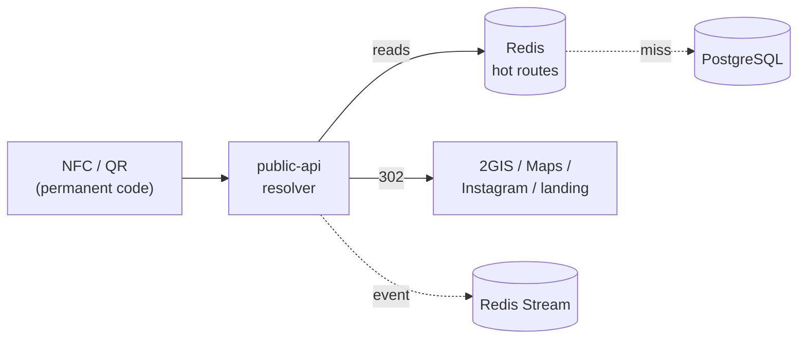
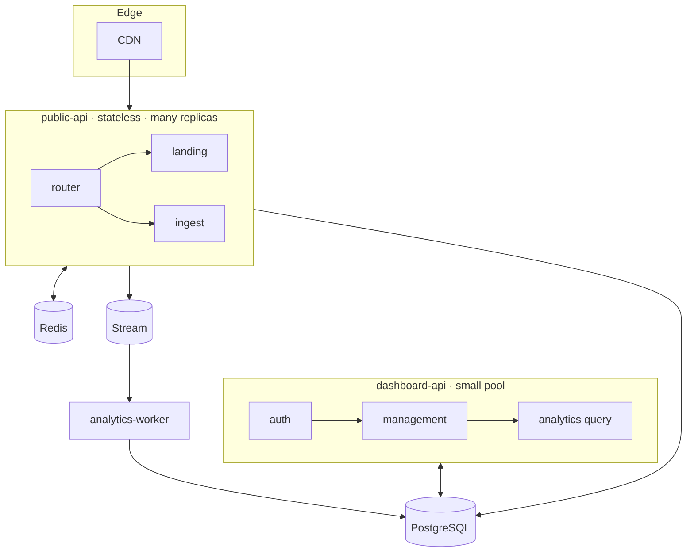
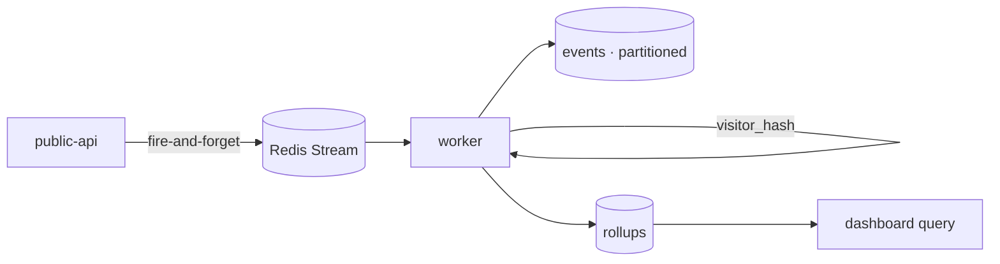

# Tanba — Design

The reasoning behind the architecture. `IMPLEMENTATION.md` covers *what* is built; this covers *why*, and what was traded away.

---

## 1. Design goals

In priority order:

1. **Physical media are immutable after deployment.** A printed tag is a permanent pointer. Nothing about a deployed tag should ever need to change.
2. **Minimal customer interaction.** One tap → the intended destination. Ideally zero extra screens.
3. **Fast public path.** A redirect that branches on platform/geo must still feel instant.
4. **Meaningful analytics without surveillance.** Useful business metrics, no PII hoarding.
5. **Multi-tenant from day one.** Hundreds of thousands of businesses, millions of links, sharing one platform safely.
6. **Extensible routing.** New routing behaviors without schema migrations or media changes.

Every major decision below traces back to one of these.

---

## 2. The core decision: indirection

Static NFC stores the destination *in the tag*. Tanba stores only a permanent identifier in the tag and resolves the destination server-side.

**Why:** it is the entire value proposition (goal 1). The cost is that we now own an always-on, low-latency resolution service. That cost is what most of the rest of the design is paying down.

---

## 3. Two applications, not one

The public surface and the management surface have opposite characteristics:

| | Public | Dashboard |
|---|--------|-----------|
| traffic | very high, spiky | low |
| read/write | ~all reads | write-heavy |
| latency | critical | relaxed |
| auth | none | required |
| exposure | the open internet | logged-in users |
| scaling unit | RPS | seats |

**Why separate:** so they scale and fail independently. A traffic spike on public tags can't starve the dashboard; a dashboard deploy can't take down redirects. The public app stays small and stateless precisely because it isn't carrying auth, billing, or admin code.

**Tradeoff:** two deployables and a shared `packages/core`. Accepted — the operational isolation is worth more than the convenience of a single process. They share one database to keep the model coherent (no premature service-per-table split).

---

## 4. Routing engine design

Destinations *are* the routing table. A SmartLink owns a list of Destinations; each carries a `match` predicate, a `priority`, and a `weight`.

**Why fold rules into Destination instead of a separate rules engine/table:** goal 6 with the fewest entities. A "rule" with no target and a "target" with no rule are both useless here — they always travel together. Keeping them as one row means one fetch, one cache entry, and an obvious mental model ("this link can go to these places, under these conditions").

**Resolution is a pure function** of `(SmartLink + Destinations, request_ctx)`. No I/O inside evaluation. Consequences:

- the whole resolution result is cacheable,
- it is exhaustively testable with a matrix of synthetic contexts,
- A/B stickiness is deterministic (seed = `visitor_hash`), so a returning visitor keeps their variant without server-side session state.

**The `match` DSL is intentionally tiny** (platform, country, city, schedule, entry). A richer rules language was rejected: it would invite slow, hard-to-cache, hard-to-test evaluation, and the four primitives cover the real cases (platform-specific map apps, regional links, weekend promos, A/B). New keys are cheap to add later.

**Tradeoff:** expressiveness is capped. Anything beyond predicate matching (e.g. arbitrary scripting) is deliberately out of scope.

---

## 5. Data model rationale — minimal entities

Eight tables, each earning its place:

`Organization` (tenant) · `User`/`Membership` (who, and in which org) · `Branch` (location) · `SmartLink` (the permanent thing) · `Destination` (where + when) · `PhysicalMedium` (optional inventory) · `InteractionEvent` (what happened) · `Subscription` (billing).

Choices worth defending:

- **`SmartLink.branch_id` is nullable** → org-level links exist without inventing a separate type. One concept, two scopes.
- **No separate `RoutingRule` table** → §4.
- **`PhysicalMedium` is optional** → Tanba is not an NFC store; a smart link is fully functional with zero media rows. Media is inventory metadata, not a dependency of routing.
- **`InteractionEvent` is denormalized** (`org_id`, `branch_id` copied in) → analytics queries scope without joins, and the table partitions cleanly by month.

**Tradeoff:** denormalized event rows can drift if a link is reparented; acceptable because events are historical facts ("this happened under this branch at this time"), not live references.

---

## 6. Analytics & privacy

**Decisions:**

- **Emit off the hot path.** The redirect never waits on analytics. A stream write that fails is logged and dropped — a customer's tap must not be held hostage to metrics (goals 2, 3).
- **Enrich in the worker, not the request.** UA parsing and GeoIP are moved off the latency-critical path.
- **Privacy by construction (goal 4).** The raw IP is used to derive coarse geo and then discarded. Uniqueness uses a daily-salted `visitor_hash`, which supports unique/repeat counts but is not a stable identity and cannot be reversed to a person. No names, no precise location, no cross-day tracking.
- **Rollups for reads.** Dashboards read pre-aggregated tables; raw partitions exist for drill-down. This keeps analytics queries cheap regardless of event volume.

**Tradeoff:** fire-and-forget means analytics are best-effort, not exact. For a reviews/engagement product, approximate counts are the right call over slowing every redirect to guarantee a write.

---

## 7. Performance & caching

The public path is optimized for cache hits:

- `route:{code}` / `route:{slug}` in Redis hold the resolved SmartLink + active Destinations. A hit means resolution touches no database.
- **Delete-on-write invalidation:** dashboard mutations delete the affected keys, so edits are effectively immediate; a TTL bounds staleness if an invalidation is ever lost. This is *delete*, not *update*, to avoid races between concurrent writers.
- **Landing pages** are edge-cacheable (`s-maxage`); **redirects are not** because they branch on per-request platform/geo. Caching a redirect at the edge would serve the wrong destination to the wrong device.
- **Negative caching** for unknown codes absorbs scanner/bot traffic without hammering Postgres.

**Why Redis over an in-process cache:** many public replicas must share one view, and invalidation must reach all of them at once.

---

## 8. Scalability strategy

Targets: hundreds of thousands of orgs, millions of links, millions of monthly interactions.

- **Stateless public app** → scale horizontally on RPS; no sticky sessions (A/B stickiness is derived, not stored).
- **CDN in front** → static and landing traffic never reaches origin.
- **Read path is cache-first** → Postgres load grows with unique-active links, not with traffic.
- **Event-driven analytics** → ingestion absorbs spikes in the stream; workers scale on lag; the heavy write volume (events) is isolated from the transactional store path and partitioned, with a clean swap to ClickHouse behind the worker's store adapter when Postgres partitions stop being enough.
- **Multi-tenant single database to start** → `org_id` on every row, filtered everywhere. Sharding by `org_id` is a later option the model already permits, deferred until it's actually needed.

**Why not microservices-per-feature now:** premature decomposition would add operational cost without solving a current bottleneck. The public/dashboard/worker split is the decomposition that matches real load boundaries; finer splits wait for evidence.

---

## 9. Security

- **No auth on public** by design — it only serves redirects/landing and accepts anonymous events. It can read SmartLink routing data but never tenant-private fields.
- **Dashboard:** JWT access/refresh, Argon2 password hashing, membership-checked on every org-scoped route.
- **Existence hiding:** unauthorized access to a resource returns 404, not 403, so the API doesn't confirm that an org/link exists.
- **Secrets** (`JWT_SECRET`, DSNs) in k8s Secrets; config in ConfigMaps.
- **Least data:** the most sensitive thing the analytics path sees (the IP) is dropped after deriving coarse geo.

---

## 10. Key tradeoffs, summarized

| Decision | Gained | Gave up |
|----------|--------|---------|
| Server-side indirection | permanent media, dynamic routing, analytics | must run an always-on low-latency service |
| Two apps, shared DB | independent scaling/failure, coherent model | two deployables |
| Rules folded into Destination | minimal entities, cacheable pure resolution | rule expressiveness capped |
| Fire-and-forget analytics | fast redirects | best-effort (approximate) metrics |
| Delete-on-write cache | near-instant edits, race-safe | brief miss-repopulate cost after edits |
| Single multi-tenant DB | simplicity now | sharding deferred to later |
| Drop IP after geo | privacy by construction | no precise geo, no cross-day identity |

---

## 11. Open questions / future

- **Store split:** when to promote analytics from partitioned Postgres to ClickHouse — driven by query latency on rollups, not a fixed date.
- **Vanity slug namespace:** org-reserved prefixes vs flat global slugs; current model allows both via `Organization.slug` + `SmartLink.slug`.
- **Edge resolution:** pushing platform/geo redirect logic to edge workers for the simplest links (no DB at all) — possible because resolution is already a pure function.
- **Roadmap surfaces** (loyalty, menus, booking, CRM/Telegram integrations, public API, white-label) attach as new SmartLink `type`s and dashboard modules without disturbing the routing core.
